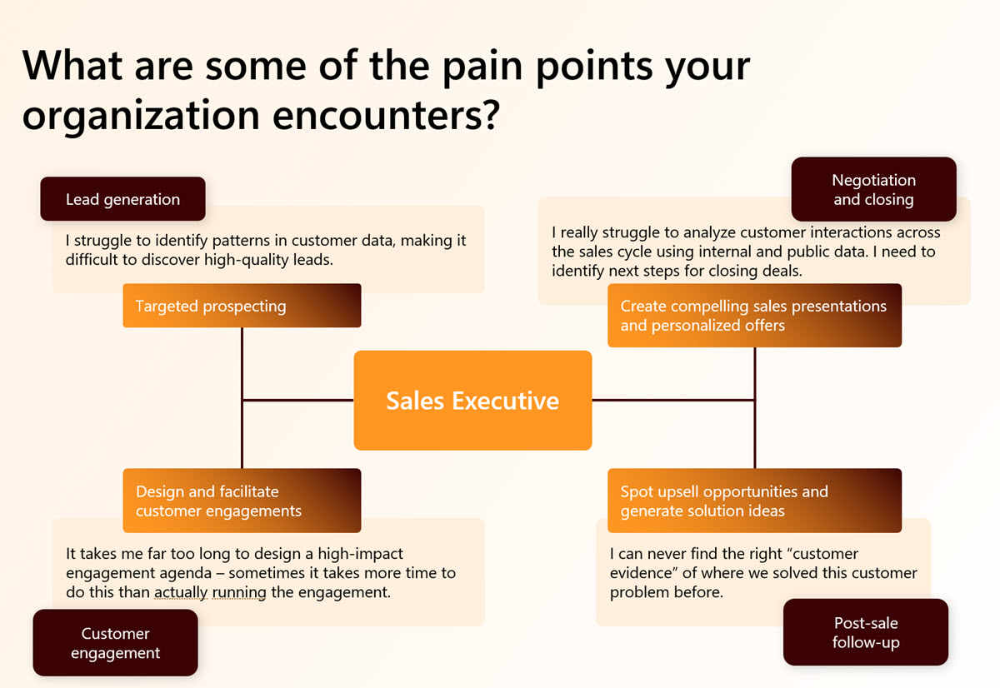
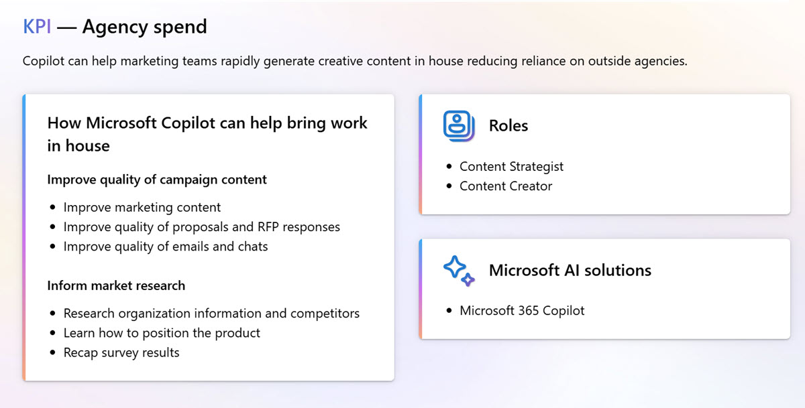
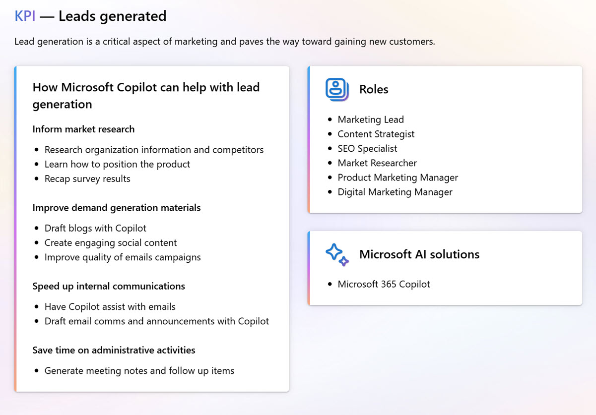
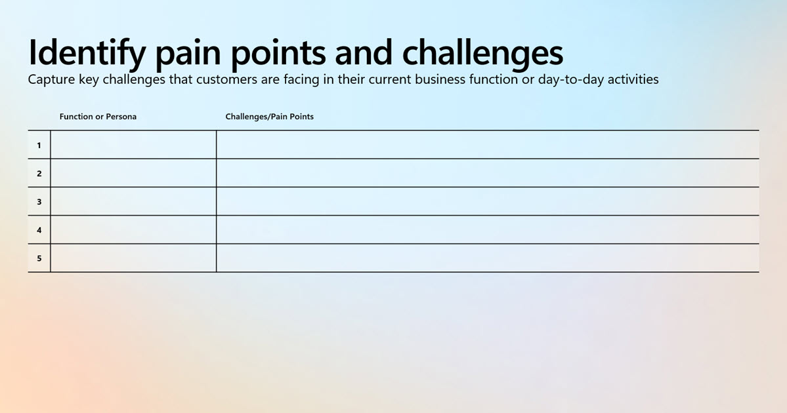
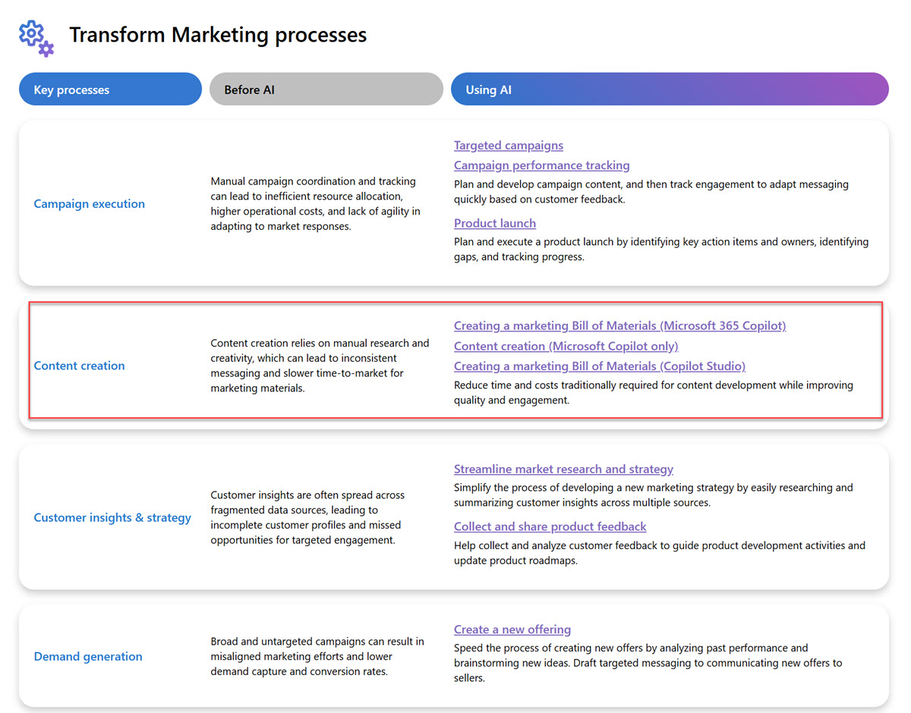
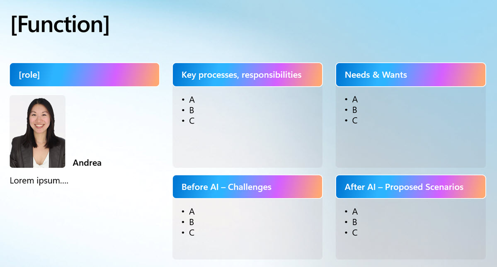
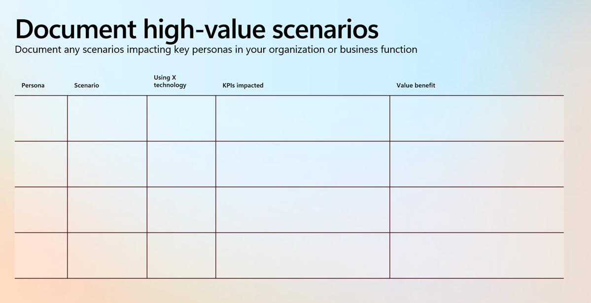
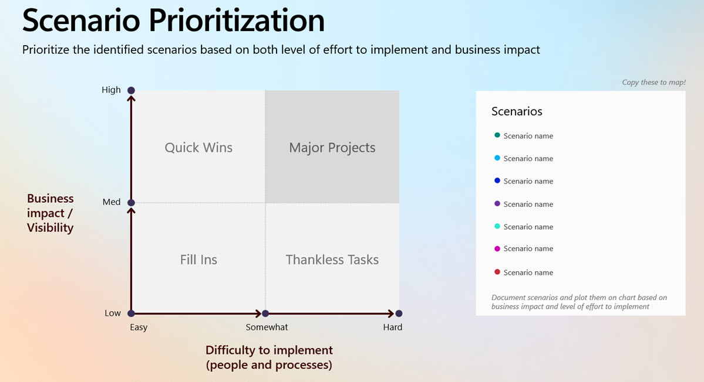
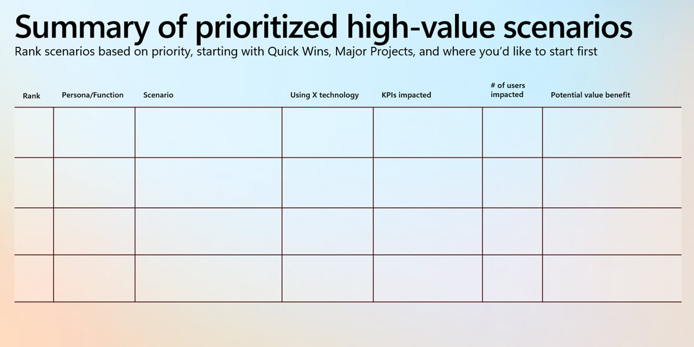

# Group activity 1: Scenario and Value Discovery practice

Depending on the size of your group, you may want to break into smaller teams to complete this exercise.

Each team should have a facilitator to guide the discussion and a scribe to document the results.

Other Students will be playing the role of the customer, and the implementation partner.

> Note: Spend around 2 minutes to distribute the roles and responsibilities among the team members.

## Exercise objectives

- Exercise 1: Identify pain points
- Exercise 2: Identify high value scenarios
- Exercise 3: Document high value scenarios
- Exercise 4: Prioritize scenarios

### Exercise 1: Identify pain points

Demonstrate how to use [Microsoft Copilot Scenario Library](https://adoption.microsoft.com/en-us/copilot-scenario-library/marketing/) for the sample scenario:

Agency Spent

Leads Generated

Documented Pain Points

 in the Template contained in [04 - Group Activity 1 - Scenario and Value Discovery Practice.pptx](/resources/04%20-%20Group%20Activity%201%20-%20Scenario%20and%20Value%20Discovery%20Practice.pptx)

Useful questions to ask:

1. What business units should we prioritize for Copilot implementation?
2. What are the different roles and personas within these units?
3. What are their core processes and daily activities?
4. What specific goals are they trying to achieve?
5. What challenges do they currently face?
6. How do they currently solve their problems?
7. How can Copilot enhance their workflow?
8. What measurable benefits can Copilot provide?
9. How will users interact with Copilot in practice?
10. Which Copilot features align with their needs?
11. In what scenarios does Copilot provide the most value?
12. How can Copilot drive positive organizational change?

### Exercise 2: Identify high value scenarios

Next Lets look at Transform Marketing processes, especially `Content creation` and [Creating a marketing Bill of Materials](https://adoption.microsoft.com/en-us/copilot-scenario-library/marketing/creating-a-marketing-bill-of-materials-copilot-for-microsoft-365/).

Let's use these questions to help you identify use cases/scenarios:

- How can Copilot improve the user's experience?

  - Think about how Copilot can alleviate the user's pain points.

- What are the potential benefits for the user?

  - Consider the positive outcomes Copilot can deliver.

- How would the user interact with Copilot?

  - Visualize the user's journey with your product.

- What are the key features that meet the user's needs?

  - Identify the aspects of Copilot that align with the user's goals.

- What are the functional scenarios where Copilot excels?

  - Pinpoint situations where Copilot outperforms other manual methods.

- How can Copilot inspire positive change?
  - Reflect on the transformative impact Copilot can have.

Fill out the scenario card:

> Note: If you feel you are in need for more theoretical information, please refer to [Establish AI-related roles and responsibilities](https://learn.microsoft.com/en-us/training/modules/scale-ai/3-establish-ai-related-roles-responsibilities).

## Exercise 3: Document high value scenarios

Document high-value scenarios including KPI's and value benefit:

## Exercise 4: Prioritize high value scenarios

> Note: If you feel you are in need for more theoretical information, please refer to [Evaluate and prioritize AI investments](https://learn.microsoft.com/en-us/training/modules/scale-ai/2-evaluate-prioritize-ai-investments) and [Apply a horizon-based framework](https://learn.microsoft.com/en-us/training/modules/scale-ai/2a-apply-horizon-framework) for more details.

Prioritize at least 2 high-value scenarios:

Create a ranked summary:

