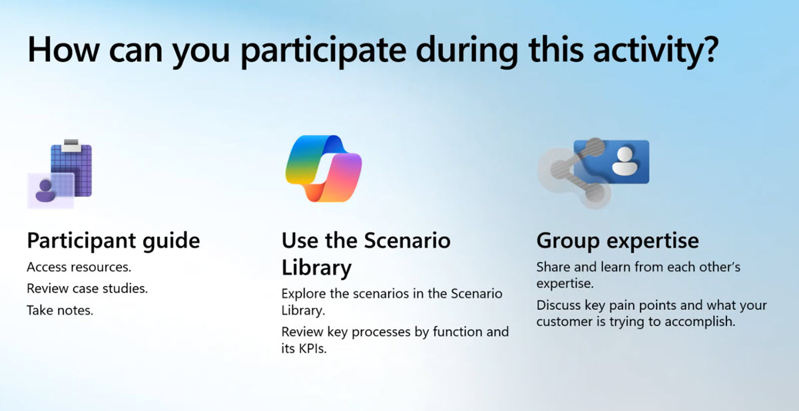

# Group Activity 2: Business Case Builder Practice

- Get ready for Group Activity 2
- What we'll be doing

## Get ready for Group Activity 2

Download [Business Case Builder Excel Worksheet](https://aka.ms/BusinessCaseBuilder) if you have access to the Partner Center, otherwise get it from [resources](../../../resources/03-01%20-%20Group%20Activity%202%20-%20Business%20Case%20Builder.xlsm).

## What we'll be doing:

1. Break back into groups of 5-6 learners.
2. Locate the customer case studies in the Participant Resources folder and your results + KPIs from Activity
3. Each learner should now take on the role of the "Partner" to practice filling in the Business Case Builder.
4. Fill in the Business Case Builder based on the case study and your scenario analysis results.
5. Produce a completed report and talk through how you'd approach discussing the results with a real customer.

> Note: Use the [Guide to the Business Case Builder](../../../resources/03-02%20-%20Group%20Activity%20Guidance.pdf) to help you through the process.
