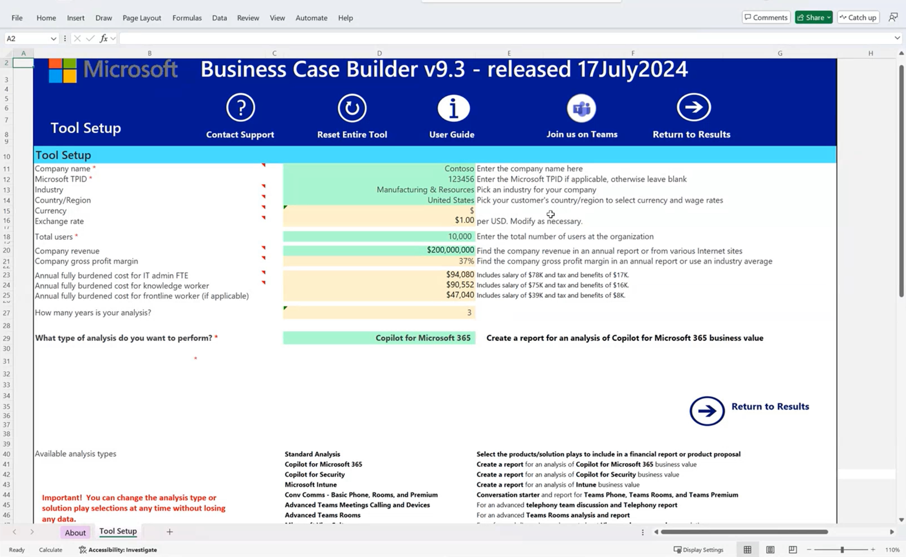

# Building a Business Case

- Building a Business Case
- The Projected Total Economic Impact™ Of Microsoft Copilot For Microsoft 365
- How to build a Business Case
- Getting ready for Group Activity 2
- Group Activity 2
- Review and Feedback

## Business Case Overview

- A business case, or cost/benefit analysis, is a financial document used to justify an investment.
- The business case looks at both the cost and the benefits of the investment decision, and then yields a set of financial metrics that are used to compare investment decisions.

## Study - The Projected Total Economic Impact™ Of Microsoft Copilot For Microsoft 365

[Study - The Projected Total Economic Impact™ Of Microsoft Copilot For Microsoft 365](https://tei.forrester.com/go/Microsoft/365Copilot/?lang=en-us)

### Executive Summary

- Generative AI as a Disruptive Technology: Generative AI, including Microsoft Copilot for Microsoft 365, is considered a disruptive business technology comparable to the internet, offering significant time savings and business transformation potential for early adopters.12

- Microsoft Copilot for Microsoft 365 Overview: Copilot for Microsoft 365 assists workers in utilizing Microsoft 365 solutions effectively, reducing information overload, worker fatigue, and innovation time frames while managing competitive pressures.2

- Forrester's Total Economic Impact Study: Forrester Consulting conducted a Total Economic Impact study to evaluate the potential ROI of deploying Copilot for Microsoft 365, projecting a return on investment between 112% and 457% and a net present value between $19.1M and $77.4M.34

- Benefits of Copilot for Microsoft 365: Copilot for Microsoft 365 is expected to transform businesses by increasing revenues, reducing costs, and improving employee experience and company culture across three pillars: go to market, operations, and people and culture.56

- Quantified and Unquantified Benefits: Quantified benefits include increased revenues, cost savings, and reduced onboarding times, while unquantified benefits include improvements in diversity, equity, inclusion, work-life balance, and compliance and security.78

- Costs and Implementation: The three-year, risk-adjusted costs for implementing Copilot for Microsoft 365 include license costs, implementation efforts, and training, totaling $16.9 million.910

### Key Challenges

- Challenges in the Workplace: Organizations face issues such as hiring difficulties, overwhelmed employees, and the "blank-page problem" in initiating creative tasks, exacerbated by remote work and disjointed information processes.

- Generative AI Technologies: The rapid growth of generative AI technologies adds complexity and security risks, necessitating careful evaluation and control of AI tools to leverage their benefits while ensuring compliance.3

- Solution Requirements: Organizations seek solutions that enhance productivity, creativity, operational efficiency, and customer satisfaction while consolidating AI tools to reduce costs and meet compliance requirements.

- Composite Organization Analysis: Forrester created a composite organization model to illustrate the financial impact of Copilot for Microsoft 365, highlighting its deployment and the expected business transformation and productivity gains.

## How to build a Business Case

- Customer context and goals
- Build the business case with KPIs
- Tailor cost assumptions
- Review results with customers

## Getting ready for Group Activity 2

Download [Business Case Builder Excel Worksheet](https://aka.ms/BusinessCaseBuilder) if you have access to the Partner Center, otherwise get it from [resources](/resources/03-01%20-%20Group%20Activity%202%20-%20Business%20Case%20Builder.xlsm).

- Give a short introduction to the Business Case Builder.

- Continue with the [group activity](group-activity-2/).
